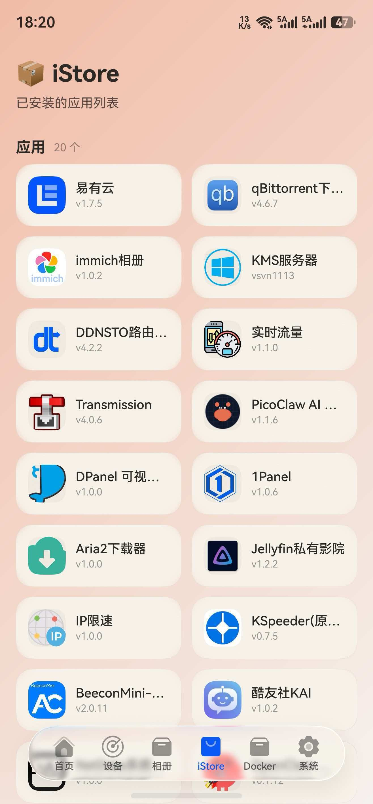

# ✨ iStore 路由管家

> 🚀 你的路由器，一个 App 全搞定！
> 基于 **HarmonyOS 6.1.0** 开发的路由器管理应用，支持 OpenWrt 全系设备。

---

## 💡 这是什么？

一款**零脚本、零安装**的路由器管理 App：

- 🏠 打开 App → 输入路由器管理地址 + 账号密码 → 秒连！
- 📊 实时监控 CPU / 内存 / 磁盘 / 网络
- 🐳 Docker 管理、📸 Immich 相册、🖥️ SSH 终端、📁 文件管理
- 🌈 统一亮色米色主题，颜值在线（v3.0 全新图标体系）

---

## 🔑 登录方式（超简单）

**账号密码登录（推荐）**：
直接输入路由器的管理地址 + 管理员账号密码即可，**无需在路由器上装任何脚本**！

- 原理：所有 LuCI 系统的 OpenWrt（iStoreOS / ImmortalWrt / QWRT / LEDE / 官方版）都内置 `/ubus` JSON-RPC 接口，App 直接对接
- 用户名一般 `root`，密码就是网页管理密码
- 默认端口 80（与 LuCI 同端口）
- 会话自动续期，失效自动重登，无感使用 🤫

**旧版 Token（已弃用，兼容保留）**：
老设备还能连（自动识别回退），编辑时填账号密码即可无缝迁移。

---

## 🎯 功能亮点

| 功能 | 说明 |
|---|---|
| 🧠 系统监控 | CPU 折线、内存/磁盘/日志进度条、主板信息、网络实时速率 |
| 📶 WiFi 管理 | SSID 配置、访客网络、无线客户端列表 |
| 📊 流量排行 | 按速率排名客户端，一眼找出「流量大户」 |
| 🛒 iStore 商店 | 应用一键直达（首页快捷入口） |
| 🐳 Docker | 容器列表 / 统计 / 守护进程状态 |
| 📁 文件管理 | 浏览/编辑/上传/下载路由器文件（SFTP） |
| ⌨️ SSH 终端 | 命令行管理路由器 |
| ⏰ 定时任务 | 定时重启、定时开关 WiFi |
| 🗺️ 网络拓扑 | 可视化设备连接关系图 |
| 🛡️ 家长控制 | OAF 应用过滤引擎配置 |
| 📸 Immich 相册 | 手机上看路由器挂的相册服务 |

### ✨ v3.0 焕新内容

- 🎨 **全应用图标统一换新**（快捷区 / 应用中心 / 数据面板 / 文件管理 / 相册…告别 emoji 乱入）
- 📊 **磁盘智能展示**：按物理硬盘汇总 + 进度条分段变色（绿≤35 / 蓝≤60 / 黄≤80 / 红>80）
- 🚀 **快捷区重构**：iStore 商店、Docker 一键直达
- 🔧 文件下载稳定性修复

---

## 🖥️ 界面长这样

| 系统监控 | iStore | 应用 |
|:---:|:---:|:---:|
|  |  |  |

| Docker 管理 |相册管理| 群聊沟通 |
|:---:|:-----------------------:|:---:|
|  |  |  |

---

## ✅ 支持的设备

| 系统 | 支持 | 说明 |
|---|---|---|
| OpenWrt | ✅ | 账号密码登录（需 LuCI 界面） |
| iStoreOS | ✅ | 账号密码登录（**已实测**） |
| QWRT | ✅ | 账号密码登录（需 LuCI 界面）  |
| ImmortalWrt | ✅ | 账号密码登录（需 LuCI 界面） |
| LEDE | ✅ | 账号密码登录（需 LuCI 界面） |

> ⚠️ **特别说明**：有些OpenWrt 精简了 rpcd 的 ACL 授权组，需要在路由器上执行**一次**授权（v1.5.0及其之前版本）：
>
> ```bash
> wget -O- https://raw.githubusercontent.com/HWYWL/iStore/main/api/qwrt-setup.sh | sh
> ```
>
> 其他系统无需任何操作，开箱即用～

> 💡 ubus 模式下受 LuCI 标准 ACL 限制，Docker 容器列表/统计、iStore 应用列表暂不可用；如需可继续用旧版 Token 设备（已弃用）。

---

## 📲 下载

- GitHub Releases：https://github.com/HWYWL/iStore/releases

---

## 🔌 技术原理（ubus 接口映射）

| App 功能 | ubus 接口 |
| --- | --- |
| 系统信息 | `system board` / `system info` |
| CPU / 进程 | `luci getProcessList` |
| 网速 | `network.interface dump` + `luci-rpc getNetworkDevices` |
| DHCP 设备 | `luci-rpc getDHCPLeases` |
| WiFi | `iwinfo info` / `iwinfo assoclist` |
| 磁盘 | `luci getMountPoints` + `luci getBlockDevices` |
| NAT 连接数 | `file read /proc/sys/net/netfilter/nf_conntrack_*` |
| 路由表 | `file exec /sbin/ip route show` |
| 重启 / 恢复出厂 | `system reboot` / `file exec /sbin/firstboot` |
| 家长控制 | `appfilter get_oaf_status` 等 |
| Docker 状态 | `service list` / `rc init` |

---

## 🛠️ 开发者专区

### 环境要求

- **DevEco Studio**: 6.1 或更高
- **HarmonyOS SDK**: 6.1.0 (API 23)
- **Node.js**: 18.19+

### 构建命令

```bash
# 编译 release 版本（发布签名，配置见 build-profile.json5）
hvigorw assembleHap -p buildMode=release --no-daemon

# 编译 debug 版本
hvigorw assembleHap -p buildMode=debug --no-daemon

# 清理构建
hvigorw clean
```

### 运行项目

1. 打开 DevEco Studio，`File → Open` 导入项目
2. 配置签名：`File → Project Structure → Signing Configs`（debug 用自动签名即可）
3. `Run → Run 'entry'` 开跑 🏃

---

## 🗂️ 页面清单

| 模块 | 页面 | 路径 |
| --- | --- | --- |
| 入口 | LoginPage | `pages/entry/LoginPage.ets` |
| 仪表盘 | MainPage | `pages/dashboard/MainPage.ets` |
| 设备 | ClientDetailPage | `pages/devices/ClientDetailPage.ets` |
| 应用 | AppsPage | `pages/apps/AppsPage.ets` |
| 网络 | RouteTablePage | `pages/network/RouteTablePage.ets` |
| 家长控制 | ParentalControlPage | `pages/parental/ParentalControlPage.ets` |
| 进程 | ProcessListPage | `pages/process/ProcessListPage.ets` |
| 系统 | RebootPage | `pages/system/RebootPage.ets` |

---

## ⚙️ 技术栈

- 🧩 **ArkTS**（HarmonyOS 声明式 UI）
- 🗃️ **单例状态管理**：AppState（设备/连接/主题）、DeviceStore（设备持久化）
- 🎨 **主题系统**：统一亮色米色风格（v3.0 起移除黑夜模式），暖橙高亮 + 大圆角卡片
- 🔌 **原生 SFTP**：C++ (libssh2) 实现，文件管理/上传下载
- 📡 **LuCI ubus** JSON-RPC 通信，零脚本零依赖

---

> 💖 觉得好用就点个 Star 吧！
