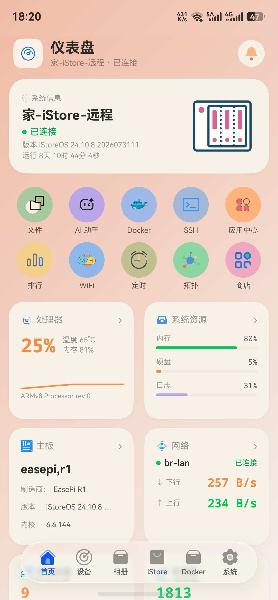
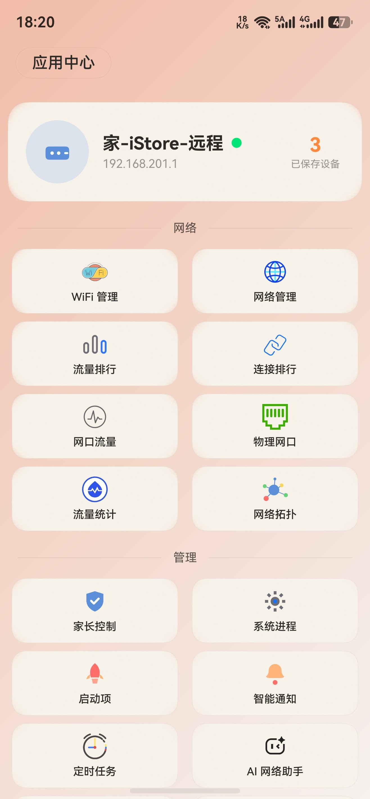
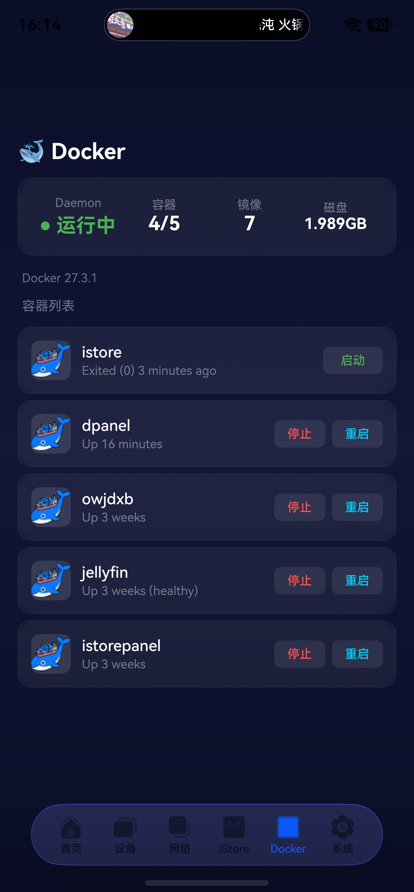

# iStore

iStore 是一款基于 **HarmonyOS 6.1.0** 开发的路由器管理应用，支持管理 OpenWrt 系列路由器设备。

## 登录方式

**账号密码登录（推荐，自2.0.0版本起）：**

直接在 App 中输入路由器的管理地址和管理员账号密码即可登录，**无需在路由器上安装任何脚本**。

实现原理：所有搭载 LuCI 网页管理界面的 OpenWrt 衍生系统（iStoreOS / ImmortalWrt / QWRT / LEDE / 官方 OpenWrt 等）都内置了 uHTTPd 的 `/ubus` JSON-RPC 接口（LuCI 的核心依赖）。App 通过该接口完成账号密码认证和数据读取，LuCI 在则功能在，无需额外维护任何脚本。

- 用户名一般为 `root`，密码为路由器的网页管理密码
- 默认端口 80（与 LuCI 同端口）
- 会话自动续期与失效重登，无需人工干预

**旧版 Token 脚本（已弃用，向后兼容）：**

早期版本通过 `router-api` CGI 脚本 + Token 登录。已保存的 Token 设备仍可正常连接（App 自动识别并回退到旧模式），编辑设备时填入账号密码即可无缝迁移到新登录方式。新设备不再支持 Token 方式。

## 功能特性

### 界面预览

| 系统监控                          | 磁盘管理                     | 应用                       |
| :---------------------------- | :----------------------- |:-------------------------|
|  |  |  |

| Docker管理                   | 网络管理                       | 系统配置                     |
|:---------------------------|:---------------------------|:-------------------------|
|  |  |  |

## 支持的设备

- **OpenWrt** - 完全支持（LuCI ubus 账号密码登录）
- **iStoreOS** - 完全支持（LuCI ubus 账号密码登录，已实测）
- **QWRT** - 支持（LuCI ubus 账号密码登录）
- **ImmortalWrt** - 支持（LuCI ubus 账号密码登录）
- **LEDE** - 支持（LuCI ubus 账号密码登录）

## APP下载
下载：https://github.com/HWYWL/iStore/releases

## 接口说明（LuCI ubus JSON-RPC）

### 概述

App 通过 OpenWrt 系统自带的 `/ubus` JSON-RPC 接口与路由器通信（由 LuCI 核心依赖 `uhttpd-mod-ubus` 提供，所有 LuCI 系统默认启用），使用路由器管理员账号密码登录，**零安装、零脚本**。

### 认证流程

```bash
# 1. 账号密码登录，获取会话 ID
curl -X POST http://192.168.1.1/ubus -d '{
  "jsonrpc":"2.0","id":1,"method":"call",
  "params":["00000000000000000000000000000000","session","login",
            {"username":"root","password":"你的密码"}]
}'
# 返回 {"result":[0,{"ubus_rpc_session":"<会话ID>","timeout":300,...}]}

# 2. 携带会话 ID 调用任意 ubus 接口
curl -X POST http://192.168.1.1/ubus -d '{
  "jsonrpc":"2.0","id":2,"method":"call",
  "params":["<会话ID>","system","board",{}]
}'
```

会话为滑动过期（默认 300 秒），App 会自动续期；会话失效后自动重新登录，用户无感知。

### App 功能与 ubus 接口映射

| App 功能 | ubus 接口 |
| --- | --- |
| 系统信息 | `system board` / `system info` |
| CPU 使用率 / 进程列表 | `luci getProcessList` |
| 网络接口 / 实时网速 | `network.interface dump` + `luci-rpc getNetworkDevices`（差值计算） |
| DHCP 设备列表 | `luci-rpc getDHCPLeases` |
| WiFi 状态 / 客户端 | `iwinfo info` / `iwinfo assoclist` |
| 存储 / 磁盘 | `luci getMountPoints` + `luci getBlockDevices` |
| NAT 连接数 | `file read /proc/sys/net/netfilter/nf_conntrack_*` |
| 路由表 | `file exec /sbin/ip route show` |
| 启动项 | `rc list` |
| 重启 / 恢复出厂 | `system reboot` / `file exec /sbin/firstboot` |
| 家长控制（OAF） | `appfilter get_oaf_status` / `class_list` / `get_app_filter_*` |
| Docker 守护进程状态 | `service list` / `rc init` |
| UCI 配置 | `uci get` |

### 兼容性

| 系统          | 支持状态 | 说明                     |
| ----------- | ---- | ---------------------- |
| OpenWrt     | ✅ 支持 | 账号密码登录（需 LuCI 网页管理界面）  |
| iStoreOS    | ✅ 支持 | 账号密码登录（已实测）            |
| QWRT        | ✅ 支持 | 账号密码登录（需 LuCI 网页管理界面）  |
| ImmortalWrt | ✅ 支持 | 账号密码登录（需 LuCI 网页管理界面）  |
| LEDE        | ✅ 支持 | 账号密码登录（需 LuCI 网页管理界面）  |

> ubus 模式下受 LuCI 标准 ACL 限制，Docker 容器列表/统计、iStore 应用列表暂不可用（Docker 守护进程状态与服务控制可用）；如需这些功能可继续使用旧版 Token 设备（已弃用，不再维护）。

## 开发环境

### 要求

- **DevEco Studio**: 4.1 或更高版本
- **HarmonyOS SDK**: 6.1.0
- **Node.js**: 18.19.0 或更高版本

### 构建命令

```bash
# 编译 release 版本
hvigorw assembleHap --mode=release

# 编译 debug 版本
hvigorw assembleHap --mode=debug

# 清理构建
hvigorw clean
```

### 运行项目

1. 打开 DevEco Studio
2. 导入项目：`File → Open → 选择项目目录`
3. 配置签名证书：`File → Project Structure → Signing Configs`
4. 运行：`Run → Run 'entry'` 或快捷键 `Shift+F10`

## 页面清单

| 模块   | 页面                  | 路径                                       |
| ---- | ------------------- | ---------------------------------------- |
| 入口   | LoginPage           | `pages/entry/LoginPage.ets`              |
| 仪表盘  | MainPage            | `pages/dashboard/MainPage.ets`           |
| 设备   | ClientDetailPage    | `pages/devices/ClientDetailPage.ets`     |
| 应用   | AppsPage            | `pages/apps/AppsPage.ets`                |
| 网络   | RouteTablePage      | `pages/network/RouteTablePage.ets`       |
| 家长控制 | ParentalControlPage | `pages/parental/ParentalControlPage.ets` |
| 进程   | ProcessListPage     | `pages/process/ProcessListPage.ets`      |
| 系统   | RebootPage          | `pages/system/RebootPage.ets`            |

## 状态管理

应用使用单例模式管理全局状态：

- **AppState**: 管理设备列表、连接状态、主题切换
- **DeviceStore**: 封装设备持久化逻辑（使用 preferences 存储）

## 主题系统

- 支持深色/浅色双主题
- 主题切换自动刷新所有监听组件
- 主题偏好持久化到 preferences

## 许可证

MIT License

## 贡献

欢迎提交 Issue 和 Pull Request！
